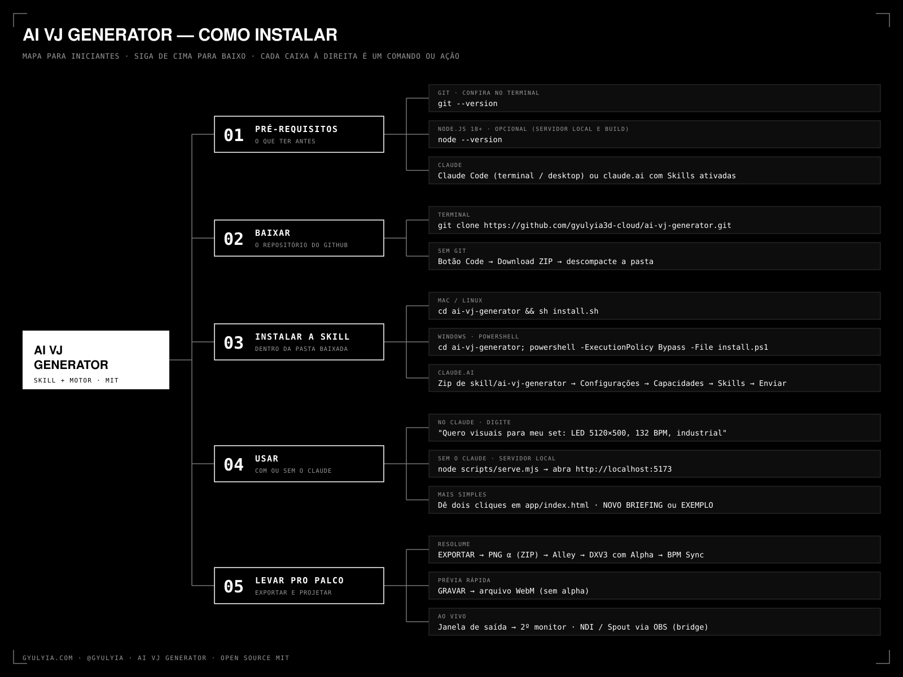

# AI VJ Generator

**Do briefing ao palco, em camadas.**

O AI VJ Generator é uma skill open source para o Claude que trabalha como diretora de arte de um set de VJ. Você conta onde vai projetar, o que o público deve sentir e qual é o BPM. Ela entrevista só o que muda a solução, transforma as respostas numa gramática visual e entrega um gerador ao vivo com cinco composições, cada uma com uma hipótese própria: estrutura, fluxo, densidade, ritmo e transformação. Cada composição é uma pilha de camadas que você liga, desliga, mistura e explode em 3D, com todos os parâmetros em slider e número, sincronizados ao BPM ou reagindo ao áudio.

## A engenharia criativa

O truque é tratar cada camada como uma função pura do número do quadro. O relógio conta quadros, não milissegundos, e toda a aleatoriedade sai de um hash com seed. A consequência prática é que o preview, o PNG e a gravação são o mesmo desenho; o último quadro encaixa no primeiro, então o loop fecha no BPM Sync do Resolume; e um `project.json` de poucos KB reproduz a peça inteira em outra máquina.

A skill e o motor são peças separadas. O Claude não reescreve código de animação a cada pedido: ele escreve a direção (gramática, nomes, palavras, paletas, parâmetros e, quando o conceito pede, um shader GLSL próprio), e o motor, testado, renderiza. O canvas vai de 16:9 a 9:16 e a paredes de LED de 5120×500. O export sai em PNG com alpha por composição ou por camada, e a conversão para DXV3 é feita no Alley. NDI, Spout e Syphon aparecem como o que são: pontes via OBS ou TouchDesigner, nunca promessas.

O modo STANDARD preserva o motor de camadas original, um organismo em filotaxia lido por um aparelho de vigilância, como baseline e biblioteca. A interface segue o design system GYULYIA: monocromática, em Martian Mono, com linhas finas e sem enfeite.

## Instalação

```bash
git clone https://github.com/SEU-USUARIO/ai-vj-generator.git && cd ai-vj-generator && sh install.sh
```

No Windows, troque o final por `powershell -ExecutionPolicy Bypass -File install.ps1`. Para usar sem o Claude, basta abrir `app/index.html` no navegador.



GYULYIA.COM · @GYULYIA · MIT
