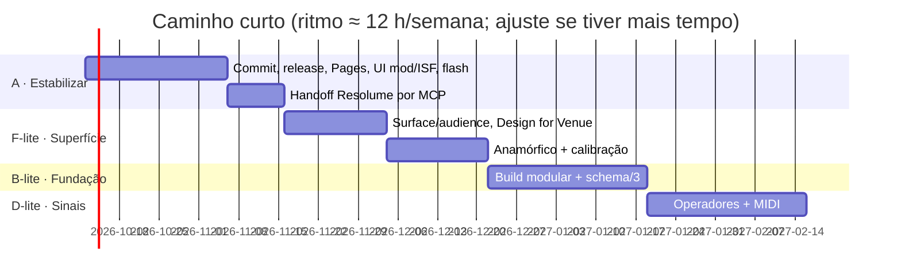
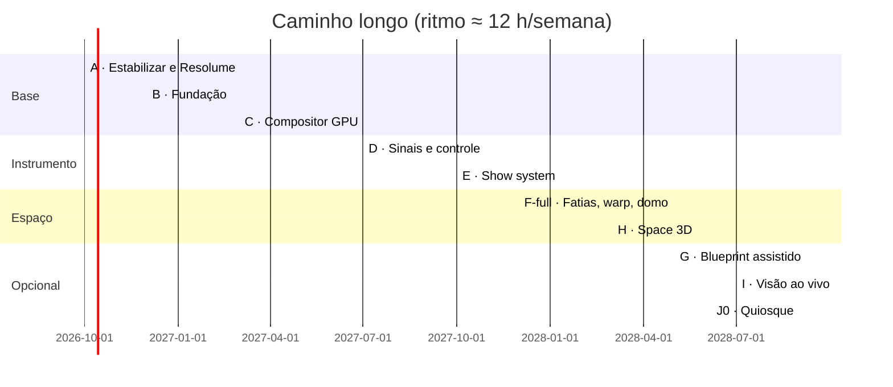
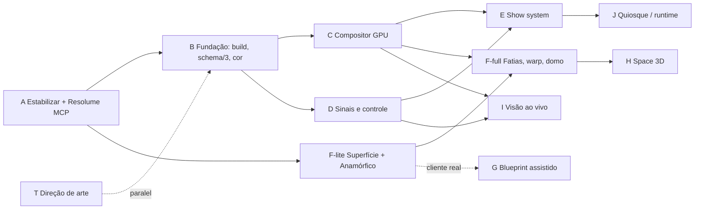

# Relatório V8 — avaliação dos três relatórios e roadmap para uma pessoa só

Data: 07/10/2026 · Autora do projeto: Giulia Ribeiro (GYULYIA) · Estado analisado: skill + motor após a V7 (instalados, não commitados)

Documentos lidos e comparados:

| Sigla | Arquivo | Origem | Natureza |
|---|---|---|---|
| **DR** | `Downloads/deep-research-report.md` | pesquisa profunda (ChatGPT/Gemini) | roadmap de 10 fases, com equipes, orçamentos em euro e datas |
| **GPT** | `Downloads/gpt-relatorio-v7.txt` | auditoria do projeto pelo ChatGPT | diagnóstico arquitetural, 95 tópicos, roadmap de 10 fases |
| **V7** | `docs/RELATORIO-V7-githubs2.md` | minha análise dos 141 repositórios | features táticas, já implementadas em grande parte |

Este documento: (1) avalia cada relatório com honestidade, (2) compara os três com o estado real do projeto, (3) decide o que entra, o que adia e o que descarta **para uma pessoa trabalhando sozinha**, (4) entrega um roadmap por prioridade e fase com critérios de aceite testáveis.

---

## 0. Resumo em uma página

**Veredito sobre os relatórios.** O GPT acerta o diagnóstico (a camada criativa cresceu mais rápido que a infraestrutura; o motor precisa de um compositor GPU, de um sistema de sinais e de uma separação entre composição e superfície). O DR acerta a organização em fases e a ideia de manifestos, mas é um plano para uma empresa de 8 a 12 pessoas e 18 a 24 meses, com orçamento de centenas de milhares de euros: **como roadmap para você, ele é inutilizável sem corte de 80%**. Os dois erram ao tratar "media server nativo" e "protocolos de hardware" como etapas naturais: para uma pessoa só, são onde projetos morrem.

**Decisão central.** Não reescrever. Evoluir em três movimentos:
1. **Estabilizar e publicar a V7** (commit, release, UI mínima para o que hoje só funciona por JSON).
2. **Trocar a fundação onde dói**: compositor GPU em WebGL2 (render graph mínimo) + motor de sinais + `index.html` modular com build. Isso destrava tudo o que os três relatórios querem (feedback, multipasso, simulações, ISF multipasso, displacement, bloom).
3. **Apostar o diferencial onde você já ganha**: o par *direção de arte + superfície real* (LED, fachada, anamórfico, DOOH), que é também o que sustenta a sua meta de renda. Mapeamento e "Design for Venue" sobem de prioridade; media server nativo, NDI/SDI nativos, MPCDI, render farm e marketplace descem para "só depois de a renda existir".

**Descoberta nova que muda o roadmap.** O Resolume já oferece servidores **MCP** (Model Context Protocol; Resolume 7.26+) para Arena, Avenue e Wire, e **você já tem esses servidores conectados ao Claude nesta máquina**. Isso torna o "adaptador Resolume" (o item 4 dos três relatórios) uma tarefa de dias, não de meses: a skill pode entregar o set direto para dentro do Arena. O DR descreveu MCP como "Mapping Control Protocol", o que está errado.

**Duas rotas de roadmap**, porque capacidade importa:
- **Caminho curto de renda (≈ 14 a 18 semanas de calendário em ritmo parcial)**: A (publicar) → B-lite (modularizar + schema/3 + cor) → F-lite (anamórfico, Design for Venue, fatias, aviso de legibilidade) → D-lite (sinais e MIDI) → handoff Resolume por MCP.
- **Caminho longo (visão, 12 a 18 meses)**: GPU compositor completo, show system, blueprint compiler assistido, espaço 3D, visão ao vivo, runtime.

---

## 1. Como avaliei

Critérios aplicados a cada proposta:

| Critério | Pergunta |
|---|---|
| Valor artístico | Melhora o que a peça diz e como parece no palco? |
| Valor de renda | Ajuda a entregar um serviço pago (clip pack, LED, fachada, DOOH anamórfico)? Sua meta é R$ 10 mil fixos até jul/2027 apostando em DOOH anamórfico. |
| Esforço solo | Dias focados de ≈ 5 h, incluindo testes. |
| Risco | Pode quebrar o que já funciona? Depende de hardware ou licença que não controlo? |
| Reuso | O Resolume, o OBS, o TouchDesigner ou uma biblioteca livre já resolvem? |
| Verificabilidade | Dá para escrever um teste automático que prove que funciona? (regra do projeto: um teste só vale se consegue falhar) |

Também verifiquei afirmações do GPT contra o repositório atual (seção 4).

---

## 2. Avaliação dos relatórios

### 2.1 DR (deep-research-report.md)

**O que vale aproveitar**
- A forma de cada fase: objetivo, entregáveis, dependências, riscos, métricas. Vou reaproveitar esse formato, mas com critérios de aceite testáveis em vez de metas inventadas.
- **Visual IR / `.vjproj`** como contrato entre a IA e o motor (concordo; já existe como `ai-vj-generator/2`, falta formalizar versão, esquema e migração).
- **Manifesto de preset** (família, estilo, custo de GPU, licença, parâmetros). Bom, e encaixa em `recipes/manifest.json`, que já existe.
- A ordem geral: núcleo gráfico → modulação → show → integrações → superfícies → visão → runtime → ecossistema.
- A lista de riscos de privacidade (modo offline sem enviar vídeo/áudio).
- Os exemplos de prompt por fase: úteis como material de trabalho, de baixo valor como roadmap.

**O que não aguenta**
- **Escala fantasiosa.** "Equipe: arquiteto, engenheiro gráfico, DSP, UI, CV, DevOps, QA"; orçamento total na casa de €800 mil; cronograma 2026 a 2028 em semanas por fase com 3 a 4 devs. Nada disso se aplica. Remover todos os valores em euro, equipes e prazos.
- **Erro factual:** "MCP (Mapping Control Protocol)". Em Resolume, MCP é o *Model Context Protocol* (7.26+). A consequência prática é grande: a integração mais barata do roadmap foi descrita como uma integração de protocolo de mapeamento.
- **Métricas arbitrárias:** "acurácia ≥ 70% em segmentação de fachadas", "exportar 8K 60 fps em menos de 1/4 do tempo real", "72 h sem intervenção", "latência < 5 ms para LFO". Sem dataset, hardware e método de medição, são números decorativos.
- **Ignora o que já existe.** O exemplo de `.vjproj` não conhece `meta.contract`, `meta.spec`, `canvas.folds`, `layer.role`, `time.bars`; os nomes são inconsistentes entre si (`Layer:Fund` referencia a camada `Fundo`). Propor "Fase 0 de 3 meses para definir o IR" quando o schema 2 já roda e passa em 10 testes é replanejar o que está pronto.
- **Salta para runtime nativo cedo demais** (Rust/wgpu + Vulkan + SDI + DeckLink + failover redundante) e para treino/uso de redes de segmentação (Detectron2, U-Net) sem dados.
- **Superficial em arte.** A direção de arte, que é seu diferencial, ganha uma frase; os 70% do texto são infraestrutura genérica de media server.
- **Cronograma em Mermaid** com datas de 2026-11 a 2028-12, mutuamente incompatíveis com a sua capacidade.

Nota: **6/10 como lista de áreas, 2/10 como roadmap executável por você.**

### 2.2 GPT (gpt-relatorio-v7.txt)

**O que vale aproveitar (alto valor)**
- **Diagnóstico de arquitetura correto**: o motor vive em um único `index.html` (agora 447 KB e 4.214 linhas); há quatro produtos acoplados (skill de IA, motor, mapeamento, show). Concordo.
- **Compositor GPU como prioridade zero.** Já estava no `RELATORIO-MELHORIAS.md` (item de performance) e no V7 (§5). O GPT acerta a justificativa: simulação, feedback, displacement, bloom e multipasso sobre uma pilha de canvases 2D com CSS gera dívida explosiva.
- **Declarar estado**: `STATELESS / STATEFUL / BAKED / PREWARMED / DETERMINISTIC_REPLAY`. Exatamente o que a camada `sim` da V7 resolveu parcialmente (bake em loop). Vale transformar em campo do schema.
- **Surface ≠ Canvas** e **audience/viewpoint**: a ideia mais valiosa do relatório inteiro para o seu mercado. Anamórfico, DOOH e fachada dependem do ponto de vista do público.
- **"Design for Venue"** (perfil do local → canvas recomendado, escala tipográfica, zonas seguras, avisos de legibilidade): barato para o motor atual (já existe `surface_calc.py`) e vendável.
- **Perfis de render e orçamento de GPU**: cada gerador declara custo; o projeto avisa antes de cair para 18 fps.
- **Sistema de sinais** (audio, MIDI, OSC, LFO, beat → operadores → qualquer parâmetro). V7 §2.3 já entregou `layer.mod`; falta a camada de operadores e a UI.
- **Typography system, material system, shape grammar, motion grammar como parâmetros** (`energy`, `elasticity`, `anticipation` convertidos em curvas). Bons como vocabulário; a V7 já traz `tension-and-release.md`; falta a parte executável (parâmetros semânticos).
- **Adapters separados do core** (`io/`, `adapters/`): princípio correto.
- **Resolume primeiro**, MCP/OSC/ISF/Spout/NDI, e "não clonar Resolume nem TouchDesigner". Concordo integralmente.
- **Color management** (espaço de trabalho linear, alpha premultiplicado, transformação de saída): subestimado no projeto atual e importante para LED e projeção.
- **"NO AI" como modo de primeira classe**: a IA é uma camada, não uma dependência do motor. Já é verdade na prática (o motor abre qualquer JSON); falta declarar e manter como regra.
- **Provenance ledger** (já existe `repo-analysis.md` e `provenance.md`).
- **O que NÃO fazer** (seção 70): 1.000 shaders agora, splats no core, clone de TouchDesigner/Resolume, todos os protocolos de uma vez, LLM no loop de render. Concordo, com a ressalva do item "splats" (veja 2.4).
- **Versão do schema + migração** desde cedo.
- **Dois modos de UI** (criativo e avançado).

**O que discordo, ou preciso ajustar**
- **Remover "todo shader é audioreativo".** É uma regra que você definiu como permanente (memória do projeto) e que resolveu um problema real (shaders mudos). O GPT tem razão em que obras contemplativas podem ser silenciosas. Proposta de meio-termo, mantendo a sua decisão: o padrão continua reativo; a composição pode declarar `audioStrategy: none | subtle | structural | rhythmic | full` e, se declarar `none`, justifica no contrato; o validador passa a avisar em vez de bloquear. **Decisão sua** (pergunta 1 da seção 14).
- **Relativizar "6 a 10 camadas".** Concordo em parte: a regra existe para evitar peças de 2 a 3 camadas planas. Meio-termo: manter 6 a 10 como padrão e permitir `layerBudget` declarado no contrato (uma peça minimalista de 1 camada é legítima se o contrato disser por quê).
- **"Presets são matéria-prima, nunca resposta final".** Compatível com a sua regra de "cada briefing do zero": as receitas e famílias são vocabulário, não composição pronta. Posso reescrever a regra de forma que as duas leituras fiquem verdadeiras.
- **Eliminar `code` layer como futuro.** Concordo em direção (IR tipado > código livre), mas o `code` layer é a válvula de escape que permitiu todo o repertório matemático; manter, e puxar o que se repete para nós tipados.
- **Roadmap de 10 fases ainda em escala de equipe.** O GPT é mais realista que o DR, mas as fases 5 a 9 (blueprint compiler, 3D completo, visão ao vivo, runtime nativo com redundância) somam anos de trabalho de uma pessoa.
- **Tabela de estado com cores (🟢🟠🔴).** Boa ideia; algumas notas estão desatualizadas (a V7 moveu áudio, mapeamento e 3D de 🔴/🟠 para 🟡), e alguns achados específicos não se reproduzem (seção 4).
- **"Não fazer tudo no browser; runtime Pro nativo."** Correto como destino; errado como próximo passo. Para você, o runtime deve ser Resolume (+ OBS/Spout) durante pelo menos o primeiro ano.
- **NDI:** o relatório trata NDI como adapter do motor. Do navegador, NDI não existe; a ponte realista é OBS (plugin NDI/Spout) ou o próprio Resolume. NDI SDK nativo só entraria com o runtime nativo.
- **Ableton Link:** não existe API de navegador; vira ponte (aplicativo local que converte Link em MIDI Clock ou WebSocket).

**O que o GPT afirma sobre o projeto e que verifiquei**
- "Retirar o `examples` indevido da skill": hoje `skill/ai-vj-generator/` contém apenas `SKILL.md`, `assets`, `references`, `scripts`; os exemplos vivem só em `examples/` do repositório. **Não reproduz.**
- "Corrigir shader que viola a regra de áudio": o validador dá ERRO para shader sem uniform de áudio e o `check.mjs` passa. **Não reproduz** (possivelmente vale para uma versão anterior).
- "Corrigir todos os checks": `check.mjs` fecha em "Tudo certo.".
- "Inconsistências de documentação": havia contradições (3–8 vs 6–10 camadas) que foram corrigidas na V5; vale rodar uma varredura nova depois da V7 (item A6).

Nota: **8/10 como diagnóstico, 5/10 como roadmap para uma pessoa**, 9/10 como lista de ideias de arquitetura.

### 2.3 V7 (meu relatório de repositórios)

**Pontos fortes:** tático, verificável, baseado em código lido; licenças tratadas (LYGIA não comercial); entregou ISF, áudio estendido, `#include`, `layer.mod`, `instrument`, `bitfield`, `sim`, `parallax`, `splat`, saída para OBS/Spout, `export_slices`, `seed_census`, com 4 conjuntos de testes novos.

**Pontos fracos (honestos):**
- Resolveu *features*, não *arquitetura*: cada camada nova ainda é um canvas 2D; `sim` é um bake em CPU, não GPU; `splat` é aproximação isotrópica; ISF não importa multipasso.
- Várias entregas só funcionam por JSON ou script (`layer.mod`, importador ISF, `depth_estimate`): faltam as telas.
- O caminho do modelo de profundidade não foi exercitado (sem torch aqui).
- Não discutiu estado de produto: versão do schema, migrações, empacotamento, release.
- Priorizou splats (por pedido seu) acima do que o GPT considera correto (baixa prioridade). Está feito, custa pouco manter, mas **não deve crescer**.

### 2.4 Conclusão da comparação em uma frase

**V7 deu os tijolos; GPT diz onde está a parede; DR diz que se precisa de uma obra com 12 pedreiros.** O roadmap abaixo usa a parede do GPT, a forma de planejamento do DR, os tijolos que já existem, e corta o número de pedreiros para um.

---

## 3. Matriz de comparação por tema

Legenda de estado: ✅ feito e testado · 🟡 parcial · ❌ não existe · ⛔ descartado/adiado.

| Tema | V7 | DR | GPT | Estado hoje (pós-V7) | Decisão V8 |
|---|---|---|---|---|---|
| Visual IR formal (`.vjproj`, schema versionado, migração) | — | Fase 0 | §4, 66, 67 | 🟡 `ai-vj-generator/2` sem versão de motor nem migração | **P1** schema/3 + JSON Schema + migração |
| Modularizar o motor (sair do `index.html` único) | — | Fase 0 | §2 | ❌ 447 KB, 4.214 linhas | **P1** src/ + build para um HTML |
| Compositor GPU, render graph, multipasso, feedback | §5 | Fase 1 | §7, 80 | ❌ canvas 2D + CSS; `sim` em CPU | **P1** núcleo da Fase C |
| WebGPU | — | Fase 1 | §8 | ❌ | ⛔ adiar; deixar a abstração pronta |
| Runtime nativo (Rust/wgpu) | — | Fase 9 | §8, 88 | ❌ | ⛔ adiar até haver renda |
| Estado declarado (stateless/stateful/baked) | §5 | Fase 1 | §22 | 🟡 `sim` assa; sem campo no schema | **P1** campo `state` no schema/3 |
| Áudio estendido (bandas, transientes, tempo integrado) | §2.2 | Fase 2 | §18 | ✅ | manter |
| Sistema de sinais (operadores, qualquer fonte → qualquer parâmetro) | §2.3 | Fase 2 | §19, 20, 81 | 🟡 `layer.mod` (fontes de áudio/LFO, sem operadores, sem UI) | **P1** Fase D |
| MIDI | RELATORIO-MELHORIAS | Fase 2 | §36 | ❌ | **P1** Web MIDI (Chrome) em Fase D |
| OSC | — | Fase 2/4 | §35, 36 | ❌ | **P2** ponte WebSocket local |
| Ableton Link / MIDI Clock / MTC / LTC | — | Fase 2/3 | §36, 37 | 🟡 tap tempo | **P2** MIDI Clock; Link por ponte |
| Timeline, cues, setlist | RELATORIO-MELHORIAS | Fase 3 | §55, 56, 82 | ❌ (há composições e transição) | **P2** Fase E |
| Crossfader A/B, troca quantizada | RELATORIO-MELHORIAS | Fase 3 | §82 | ❌ | **P2** |
| Segurança (flash limiter, blackout, test pattern, last-known-good) | RELATORIO-MELHORIAS | Fase 9 | §6, 63 | 🟡 cartões de teste | **P1** limitador de flash (saúde) + blackout |
| Adaptador Resolume (MCP, ISF, Spout, XML) | §2.1, 2.9, 2.10 | Fase 4 | §31, 32, 83 | 🟡 ISF, Spout via OBS, XML de slices | **P0** handoff por MCP (você já tem os servidores) |
| TouchDesigner, MadMapper | — | Fase 4 | §33, 34 | ❌ | **P3** só descrever ponte; sem código |
| NDI | — | Fase 4 | §35 | ⛔ não existe no navegador | **P3** via OBS ou Resolume; sem SDK |
| Art-Net, sACN, SDI, DeckLink | — | Fase 9 | §35 | ⛔ | ⛔ |
| Surface graph (superfície ≠ canvas) | §2.10 | Fase 5 | §10 | 🟡 `canvas.folds`, `surface_calc`, `export_slices` | **P1** Fase F |
| Anamórfico e ponto de vista do público | — | — | §58, 59 | ❌ | **P0/P1** (ligado à sua renda) |
| Design for Venue (perfil do local, legibilidade) | — | — | §60 | 🟡 `surface_calc` | **P1** |
| Quad warp, mesh warp, edge blend, black level | — | Fase 5 | §13 | ❌ (só slices) | **P2** warp 4 cantos e prévia de blend |
| Domo (fisheye, equiretangular) | — | Fase 5/7 | §14 | ❌ | **P2** receitas e projeção, sem editor |
| MPCDI | — | Fase 5 | §13 | ⛔ | ⛔ |
| Calibração (padrões de teste) | — | Fase 9 | §63 | ✅ cartões de teste + padrão do `export_slices` | ampliar em Fase F |
| Compilador de blueprint (CV, semântica arquitetural) | — | Fase 6 | §11, 12, 85 | ❌ | **P3** assistido (traçar com ajuda), sem ML próprio |
| 3D / espaço de evento (glTF, PBR, HDRI, câmera) | `splat`, `parallax`, objeto 3D | Fase 7 | §27, 28 | 🟡 objeto 3D (.obj/.glb/.stl), splat, parallax | **P2** previz de palco com Three.js |
| Gaussian splatting | §3 do V7 | Fase 7 | baixa prioridade | ✅ aproximação | **congelar** |
| Visão ao vivo (webcam, tracking) | — | Fase 8 | §29, 30 | ❌ | **P3** MediaPipe no navegador como fonte de sinais |
| Media server / redundância / watchdog | — | Fase 9 | §6, 88 | ⛔ | ⛔ (Resolume faz) |
| Color management | — | nota | §38 | ❌ (há `color-science.md`, OKLCH) | **P1** pipeline linear e premultiplicado |
| Gestão de assets (hash, proxy, colorspace) | — | nota | §39 | ❌ (dados embutidos no JSON) | **P2** |
| Perfis de render e orçamento de GPU | — | — | §41, 42 | ❌ | **P1** depois do compositor |
| Diagnostics / Doctor | — | Fase 9 | §43, 64 | 🟡 `layerAudit`, validador | **P2** aba Sistema e `doctor` |
| Biblioteca em famílias + manifesto + maturidade | §2.5 | Fase 10 | §24 a 26 | 🟡 `recipes/manifest.json` | **P2** |
| Parâmetros semânticos (`motion.energy`, `material.roughness`) | — | — | §16, 72, 73 | ❌ | **P2** camada semântica sobre `p` |
| Materiais, partículas, formas como sistemas | — | — | §49 a 52 | 🟡 | **P3** reorganização da biblioteca |
| Motion grammar executável | §2.7 (texto) | — | §15, 16 | 🟡 texto | **P2** perfis de movimento viram curvas |
| Reference decompiler, art bible, avaliador de qualidade | — | Fase 0 | §44 a 47 | 🟡 `quality-gates`, contrato | **P2** |
| Typography system | — | — | §48 | 🟡 `typewall`, `pixeltext`, `text` | **P3** |
| AI provider neutrality e modo "NO AI" | — | Fase 0 | §68, 69 | 🟡 | **P1** declarar e testar |
| Plugin SDK, marketplace | — | Fase 10 | §74, 75 | ❌ | **P3** |
| Free/Pro/Enterprise | — | Fase 10 | §75 | — | decisão de negócio; adiar |
| Provenance ledger | §4 | Fase 0 | §76 | ✅ `repo-analysis.md`, `provenance.md` | manter e automatizar |

---

## 4. Estado real do projeto hoje

Números medidos nesta sessão:

| Item | Valor |
|---|---|
| Motor | `app/index.html`, 447 KB, 4.214 linhas, um arquivo (cópia em `skill/.../assets/engine.html`) |
| Geradores registrados | 29 (`bg organism structure measure data hud event post lines instrument bitfield sim parallax splat flow tunnel typewall shader image video model shape text code pixeltext symbols hazard blocks logo`) |
| Skill | `SKILL.md` roteador + 44 arquivos em `references/` + 28 scripts |
| Testes | `check.mjs` (tudo verde) com: validador, receitas, loop (com controle negativo), interface, layout, recursos V6, V7 (áudio, mod, instrument, bitfield, sim, parallax, splat, palco), ISF, biblioteca GLSL, fatias do Resolume |
| Git | 3 commits antigos; a V6 e a V7 estão **sem commit** (46 arquivos modificados ou novos) |
| Publicação | GitHub `gyulyia3d-cloud/ai-vj-generator` (V5/passo 1); sem release, sem Pages |
| Integração Resolume | ISF exporta e importa; saída por OBS+Spout2 (documentada); XML de Advanced Output (testado contra exemplo real); MCP do Arena **disponível mas não usado** |

O que isso significa: a "camada criativa" (briefing, contrato, receitas, validação, critique) está madura. A "camada de execução" tem três limites estruturais: (1) composição por canvases 2D; (2) nenhum sinal além de áudio e LFO; (3) nenhuma noção de ponto de vista do público nem de saída física além de fatias. Os três relatórios convergem nesses três pontos.

---

## 5. Princípios de decisão para uma pessoa só

1. **Cada fase termina com algo que você consegue vender ou usar num show.** Fases que só entregam "infraestrutura" são quebradas em passos que entregam algo visível a cada 2 a 3 semanas.
2. **Reaproveitar antes de construir.** Resolume (saída, mapeamento, show), OBS (Spout, NDI, captura), Three.js (3D), MediaPipe (visão), esbuild (build). Escrever código próprio só onde o diferencial é seu: direção de arte, IR, superfície consciente do espaço.
3. **Um teste por promessa.** Toda feature nova entra com teste que falha se ela quebrar (regra herdada: controle negativo/mutação). O compositor GPU, em particular, entra com teste de **paridade de pixels** contra o renderizador atual.
4. **Uma coisa instável por vez.** Nunca mexer ao mesmo tempo em renderizador, schema e interface.
5. **Congelar o que está bom.** `splat`, `sim`, `parallax`, `instrument` entram em modo manutenção.
6. **Decidir por reversibilidade.** Preferir mudanças que podem ser desfeitas (flag, build separado) a reescritas.
7. **Licença antes de código.** Registrar no ledger o que entrou, de onde, com que licença (já é prática).
8. **Pontos de decisão (gates) explícitos**, em que você escolhe continuar, pausar ou cortar a fase, com base em medição, não em entusiasmo.

Capacidade assumida (ajuste se estiver errada): ≈ 12 h por semana, ou **≈ 2,4 dias focados de 5 h por semana**. Todos os esforços abaixo estão em **dias focados (df)**; calendário = df ÷ 2,4. Com 25 h por semana, divida o calendário por dois.

---

## 6. Decisões de arquitetura (ADRs resumidos)

**ADR-1. Visual IR = evolução do schema 2, não reescrita.**
Criar `ai-vj-generator/3` com: `engine` (faixa de versões compatíveis), `capabilities.required`, `state` por camada (`stateless | stateful | baked | prewarmed`), parâmetros semânticos opcionais, `surface`/`audience` como blocos próprios, `signals` (grafo de modulação), `provenance`. Schema 2 continua carregando por **migração automática** (`scripts/migrate.py`, com testes de ida e volta nos 3 exemplos). Alternativa descartada: formato novo `.vjproj` independente (custa a migração de tudo e não traz nada que o schema 3 não traga).

**ADR-2. Modularizar com build, mantendo um artefato único.**
Código-fonte em `src/` (módulos ES), build com esbuild gera o mesmo `app/index.html` e `engine.html` que os testes e a skill já consomem. Ordem de extração: constantes/util → áudio → geradores (um arquivo por gerador) → interface. Critério: `check.mjs` passa idêntico antes e depois; diferença de tamanho < 5%. Alternativa descartada: framework (React/Vue); o motor é quase todo canvas e não ganha nada.

**ADR-3. Compositor GPU em WebGL2, híbrido.**
Cada camada produz uma textura (geradores 2D continuam desenhando em canvas e são enviados como textura; shaders e simulações rodam direto em FBO). Um **render graph mínimo** (lista de passes com entradas e saídas nomeadas, buffers persistentes) compõe, aplica blends em shader e entrega a textura final. Exportação lê a textura final (`readPixels`/`OffscreenCanvas`). Alternativas: WebGPU (adiar: suporte e ferramentas ainda variam; manter a abstração `Renderer` para trocar depois) e runtime nativo (adiar).

**ADR-4. Sinais como grafo de dados, não como `if (audio)` espalhado.**
`signals`: fontes (audio, midi, osc, lfo, noise, beat, timeline, tracking) → operadores (remap, clamp, smooth/lag, curve, quantize, sample-hold, peak/decay, math, follow) → destinos (`layerId.paramId`). `layer.mod` vira açúcar sobre esse grafo. Determinismo preservado: fontes não determinísticas (MIDI/OSC ao vivo) só atuam no modo ao vivo; export usa fontes sintéticas ou gravadas.

**ADR-5. Studio no navegador, runtime = Resolume/OBS.**
Studio (este projeto) cria, pré-visualiza e exporta; para o palco, entrega ISF, clipes, saída Spout via OBS, XML de saída e, quando possível, monta o set no Arena por MCP. Runtime nativo próprio só entra se (a) houver renda recorrente e (b) um cliente exigir algo que Resolume não faz.

**ADR-6. IA como camada, não como dependência.**
Contrato único de entrada do motor: JSON validado. Qualquer IA (Claude, Codex, Gemini, local) produz o mesmo JSON; o motor não sabe quem criou. Teste: um conjunto de projetos escritos à mão e um por IA passam pelo mesmo validador. Nenhum LLM dentro do loop de render (concordo com o GPT).

**ADR-7. Superfície é entidade própria.**
`surface` (tipo, dimensões físicas, pitch, orientação), `screens` e `slices` (já existe em `export_slices`), `audience` (posição, altura, distância, ângulo), `display` (emissivo, projetado, refletivo, LED transparente). A composição é renderizada no espaço da superfície, não no do canvas. Modo anamórfico = render em câmera do público.

**ADR-8. Regras da skill: padrão forte, exceção declarada.**
Áudio, número de camadas e "do zero" permanecem como padrão; passam a aceitar exceção **declarada no contrato** (`audioStrategy`, `layerBudget`, `libraryUse`), que o validador registra como aviso. Mantém a sua autoria e abre espaço para peças contemplativas e minimalistas. (Pergunta 1 e 2 da seção 14.)

---

## 7. Roadmap por fases

Convenções: **P0** = fazer agora; **P1** = próxima camada, bloqueia o resto; **P2** = depois da fundação; **P3** = só com gate de decisão. df = dias focados de 5 h. Cada fase tem **gate** (checagem de decisão).

### Fase A — Estabilizar, publicar e usar o Resolume por MCP (P0) · ≈ 11 df (≈ 4,5 semanas)

Objetivo: transformar a V7 em algo versionado, publicável e demonstrável; fechar as lacunas de interface; e ligar o Claude ao Resolume.

| ID | Entrega | df | Aceite |
|---|---|---|---|
| A1 | Commit da V6 + V7 em commits temáticos; tag `v2.2.0`; release no GitHub com `skill.zip` e `engine.html`; GitHub Pages com o motor | 1 | tag publicada; Pages abre o motor e passa `?qa=1` |
| A2 | UI mínima para `layer.mod` (aba Parâmetros: lista de modulações, fonte, intervalo, modo) | 2 | teste de interface cria, edita, remove; JSON exportado valida |
| A3 | Importador ISF na interface (arrastar `.fs`; relatório "importável/não e por quê") | 1,5 | arrastar 3 fixtures: 2 entram, 1 é recusada com motivo |
| A4 | Telas para `sim`, `parallax`, `splat`, `instrument` já aparecem pela lista de parâmetros; conferir rótulos EN/PT e ajuda | 1 | varredura i18n: 0 chaves PT sem EN nas camadas novas |
| A5 | **Handoff Resolume por MCP** (skill nova `resolume-handoff`): depois do `/vj`, oferece montar a composição no Arena (colunas = composições, layers = camadas ISF/clipes, BPM, saída) usando os servidores MCP que você já tem; fallback documentado se não estiver conectado | 3 | em máquina com Arena aberto: 1 projeto de 3 composições aparece em 3 colunas com os parâmetros ligados; log de comandos; sem salvar sem sua confirmação (regra do servidor) |
| A6 | Varredura de consistência de docs pós-V7 (regras, contagens, caminhos citados) e `docs/` com índice | 1 | `check.mjs` verifica contagens citadas; 0 contradições |
| A7 | Aviso de flash (fotossensibilidade): limitador global de ≥ 3 flashes por segundo, ligado por padrão | 1,5 | teste: 6 hits por segundo são atenuados; aviso na validação |

Riscos: A5 depende de versão do Resolume (≥ 7.26) e de o servidor estar ativo; mitigar com checagem `status` antes de qualquer ação e com modo "só descreve o que faria".
**Gate A:** você consegue, de um briefing, chegar a um clipe vivo no Resolume em menos de 30 minutos, sem tocar em JSON? Se não, não avance.

### Fase B — Fundação: schema/3, motor modular, cor (P1) · ≈ 16 df (≈ 6,5 semanas)

Objetivo: tirar o risco de crescer sobre `index.html`, e fechar o contrato de dados.

| ID | Entrega | df | Aceite |
|---|---|---|---|
| B1 | **ADR-2 em prática:** `src/` + esbuild; extrair util, áudio e geradores um a um | 6 | `check.mjs` idêntico; tamanho do HTML dentro de 5%; build em < 10 s |
| B2 | **Schema/3** + JSON Schema oficial + `migrate.py` (2→3) + `engine.compat` | 3 | os 3 exemplos migram e voltam; migração de arquivo inválido falha com mensagem |
| B3 | Campo `state` por camada e `audioStrategy`, `layerBudget`, `libraryUse` no contrato | 1 | validador aplica as exceções (ADR-8) |
| B4 | **Pipeline de cor**: espaço de trabalho declarado (sRGB hoje; linear no compositor GPU), alpha premultiplicado auditado em export, ponto de saída por tipo de display (LED/projeção/tela) | 3 | teste: round-trip de cor ≤ 1/255; export de alpha sem halo escuro em fundo branco |
| B5 | Manifesto de recursos (`recipes`, geradores, módulos GLSL) com família, custo de GPU estimado, superfícies adequadas, licença, maturidade (`sketch/studio/stage`) | 2 | validador recusa recurso sem licença; UI filtra por maturidade |
| B6 | Modo "sem IA" declarado e testado: criar projeto só pela interface a partir de receitas, exportar, validar | 1 | roteiro automatizado cria e exporta projeto sem tocar na skill |

**Gate B:** após modularizar, o tempo para adicionar um gerador novo (arquivo, teste, doc) caiu? Meça: a V7 gastou ≈ 1 dia por gerador; meta ≤ 0,5.

### Fase C — Compositor GPU (WebGL2) e render graph (P1) · ≈ 24 df (≈ 10 semanas)

Objetivo: remover o teto técnico; maior risco do roadmap; fazer em fatias com paridade de pixels.

| ID | Entrega | df | Aceite |
|---|---|---|---|
| C1 | Camada `Renderer` abstrata; implementação 2D atual como `canvas2d`; testes de paridade (capturas de referência dos 3 exemplos × 5 quadros) | 3 | `renderer: canvas2d` reproduz todas as capturas |
| C2 | Implementação `webgl2`: textura por camada, blends em shader (normal, add, screen, multiply, difference, overlay, lighten), composição final | 6 | paridade ≤ 1/255 por canal em 95% dos pixels dos exemplos; mais rápido que `canvas2d` em 1080p (medir) |
| C3 | Render graph mínimo: passes nomeados, buffers persistentes (ping-pong), entradas de textura em shaders (imagem, vídeo, espectro) | 5 | shader com `texture2D(uTex)` desenha; feedback simples fecha o loop com bake |
| C4 | Pós-processamento como passes: bloom, blur, displacement por mapa, aberração cromática, vinheta, grão, LED/CRT (da biblioteca GLSL) | 4 | cada passe com teste e custo medido |
| C5 | `sim` em GPU (reação-difusão e tinta) mantendo o bake em loop e determinismo (comparar com a versão CPU) | 3 | quadro N idêntico em duas execuções; custo < 2 ms em 1080p |
| C6 | **ISF multipasso** (PASSES e PERSISTENT) usando o render graph | 2 | ≥ 60% dos ISF com PASSES da coleção estudada importam e desenham |
| C7 | Orçamento de GPU: cada gerador declara passes/VRAM; o projeto soma e avisa; perfis de render (`preview`, `stage`, `led-master`, `dome`) | 1 | aviso aparece para 8K + 4 passes de feedback; perfis mudam resolução e qualidade |

Riscos: precisão de float em WebGL2 (usar `EXT_color_buffer_float`, com fallback); diferença visual sutil em blends; regressão em export. Mitigação: paridade de pixels e flag `renderer` para voltar ao 2D.
**Gate C:** paridade passa, FPS ≥ do 2D em 1080p, `loop_check` verde. Se a paridade não fechar em 3 semanas, pare e reavalie (talvez manter híbrido).

### Fase D — Sinais e controle (P1) · ≈ 14 df (≈ 6 semanas)

| ID | Entrega | df | Aceite |
|---|---|---|---|
| D1 | Grafo `signals` no schema/3; operadores (remap, clamp, smooth/lag, curve, quantize, sample-hold, peak/decay, math, follow); `layer.mod` vira açúcar | 3 | cada operador com teste numérico; ciclo detectado e recusado |
| D2 | Análise de áudio melhor: fluxo espectral (onset), bandas por oitava com ponderação, "kick detector" com histórico (modelo do reator), BPM estimado | 3 | teste com áudio sintético (kicks a 128 BPM) detecta ≥ 95% dos golpes |
| D3 | **Web MIDI** (Chrome/Edge): aprender (clique no parâmetro, gire o knob), pads trocam composição, MIDI Clock sincroniza BPM | 3 | teste com porta MIDI virtual; mapa salvo no projeto |
| D4 | Ponte local **OSC ↔ WebSocket** (script Node de 100 linhas) e TouchOSC/OSCAR documentado | 2 | mensagem OSC altera parâmetro; latência medida |
| D5 | UI de modulação (grafo simples em lista, não editor de nós) | 3 | criar cadeia fonte → 2 operadores → parâmetro pela interface |

Determinismo: fontes ao vivo (MIDI/OSC/áudio) marcadas `live`; export as congela ou usa gravação (`record signals`).
**Gate D:** você toca um set de 10 minutos com controlador sem abrir JSON.

### Fase E — Show system (P2) · ≈ 13 df (≈ 5,5 semanas)

| ID | Entrega | df | Aceite |
|---|---|---|---|
| E1 | Cues e setlist: lista ordenada de composições com duração em compassos e transição; autoplay | 3 | set de 4 cues avança sozinho no compasso certo |
| E2 | Troca quantizada (imediata, próximo beat, próximo compasso) e **crossfader A/B** com dois decks | 3 | teste: troca no beat; duas composições misturadas com blend escolhido |
| E3 | Timeline visual simples (trilhas por camada, marcadores de evento, cues) em modo avançado | 4 | arrastar marcador altera o evento; export respeita |
| E4 | Segurança: blackout, quadro seguro, último estado bom, autosave/recuperação de projeto, modo "tela de teste" | 2 | queda simulada recupera o projeto; blackout em 1 quadro |
| E5 | Modo contínuo (um universo persistente com fases e deriva de parâmetros) | 1 | exemplo de 20 minutos sem repetição visível de loop curto |

**Gate E:** um set completo (30 min) rodando em estúdio sem intervenção.

### Fase F — Superfície, anamórfico e Design for Venue (P0/P1 em versão curta; P2 nas partes grandes) · ≈ 20 df (≈ 8 semanas)

Esta é a fase que mais se liga à sua renda (DOOH anamórfico, LED, fachada). Dividida em **F-lite (P0/P1)** e **F-full (P2)**.

**F-lite — ≈ 9 df**

| ID | Entrega | df | Aceite |
|---|---|---|---|
| F1 | Bloco `surface` e `audience` no schema/3 (tipo, medidas, pitch, posição do público, altura, distância, ângulo, display físico) | 2 | validador cruza com `canvas` e `meta.spec` |
| F2 | **Design for Venue**: dado perfil do local, gera canvas recomendado, escala tipográfica, zonas seguras, contraste mínimo, **avisos de legibilidade por região** ("esta área perde legibilidade a 28 m") | 3 | casos conhecidos (LED 4500×800 a 15 m; fachada a 40 m) batem com `surface_calc` |
| F3 | **Modo anamórfico**: renderizar a composição na câmera do público sobre uma superfície em L/cubo (forçar perspectiva); prévia com ponto de vista ajustável | 3 | cena de teste (cubo 3 faces) parece correta do ponto marcado; erro angular medido |
| F4 | Padrões de calibração ampliados (grid, barras, xadrez, pixel grid, lat/long, borda de blend) e exportáveis | 1 | gera PNG; checagem automática de dimensões |

**F-full — ≈ 11 df (P2)**

| ID | Entrega | df | Aceite |
|---|---|---|---|
| F5 | Interface de **fatias** (arrastar, cortar, girar 90°, flip), exporta XML Resolume (já existe) e CSV Hippotizer | 4 | importa e reexporta o XML do exemplo sem perda |
| F6 | **Warp de 4 cantos** (homografia) por fatia e prévia de edge blend e black level | 4 | erro de reprojeção < 1 px em grade de teste |
| F7 | **Domo/fisheye/equiretangular**: projeções e receitas (sem editor de malha) | 3 | render fisheye 180 de uma cena de teste confere com fórmula |

Não entra: MPCDI, malhas arbitrárias, calibração automática por câmera, 3D de projetores.
**Gate F:** um briefing real de DOOH anamórfico é entregue do começo ao fim por este fluxo.

### Fase G — Compilador de blueprint assistido (P3) · ≈ 12 df

Premissa: não treinar redes. Usar visão do Claude para **propor** e você **confirmar**.

| ID | Entrega | df | Aceite |
|---|---|---|---|
| G1 | Entrada de planta/foto/PDF/SVG; extração de retângulos e linhas por OpenCV clássico; vetorização de SVG/DXF simples | 4 | 5 plantas de teste: ≥ 80% dos módulos retangulares detectados |
| G2 | Claude (visão) propõe superfícies nomeadas (fachada, janelas, módulos LED) sobre a imagem; interface de correção manual (polígonos arrastáveis) | 5 | usuário corrige e confirma em < 10 min; saída é `surface` válido |
| G3 | UV automático por superfície plana e cilíndrica; exporta `surface` + `slices` | 3 | UV conferido em grade de teste |

**Gate G:** só começar após F-lite entregue em cliente real. Se nenhum cliente pediu fachada com planta, adie.

### Fase H — Espaço 3D de previsualização (P2/P3) · ≈ 10 df

| ID | Entrega | df | Aceite |
|---|---|---|---|
| H1 | Aba **Space**: Three.js, palco com telas e fatias texturizadas com a composição ao vivo, câmera orbital e câmera do público | 5 | a composição aparece em todas as telas; câmera do público bate com F3 |
| H2 | Importar glTF/GLB de superfície (edifício/palco), luzes simples, HDRI | 3 | carrega 3 modelos de teste |
| H3 | Frustum de projetor e simulação de cobertura (aviso de sombra) | 2 | cobertura numérica confere com cálculo manual |

### Fase I — Entradas ao vivo e visão (P3) · ≈ 12 df

| ID | Entrega | df | Aceite |
|---|---|---|---|
| I1 | Webcam/captura via `getUserMedia` como textura (já com o compositor GPU) | 2 | webcam aparece como camada; latência medida |
| I2 | **MediaPipe** (face, mãos, pose) como **fontes de sinal** (não efeito): posição, escala, abertura da boca, etc. | 4 | sinais alimentam `layer.mod`; privacidade: nada sai do dispositivo |
| I3 | Fluxo óptico em GPU como mapa de deslocamento | 3 | mapa estável a 30 fps em 720p |
| I4 | Entrada Spout/NDI via OBS (documentado, sem SDK) | 1 | caminho testado com uma fonte do Resolume |
| I5 | Mapas de profundidade em tempo real (opcional; modelo pequeno) | 2 | só se houver caso de uso real |

### Fase J — Runtime profissional (P3, com gate de renda)

Não planejar em df. Decisão por etapas:
1. **J0 (≈ 3 df):** `kiosk` — empacotar o motor em Tauri/Electron com tela cheia, reinício automático (watchdog em script), `doctor` (verifica GPU, FPS, memória) e carregamento por URL/parâmetros. Resolve 80% dos casos de instalação sem runtime nativo.
2. **J1 (só com cliente):** saídas múltiplas por janelas sincronizadas (já há `openOutput`).
3. **J2 (só com receita recorrente):** avaliar runtime nativo com `wgpu`; spike de 10 df antes de decidir.

Nunca antes de a Fase F estar em uso real: sem superfícies, saídas físicas não têm onde acontecer.

### Fase K — Ecossistema (P3, contínuo e leve)

- Pacotes de recursos (`recipes`, módulos GLSL, famílias) com `manifest.json` e licença (B5).
- Guia de contribuição, `CONTRIBUTING.md` já existe; adicionar modelo de pacote.
- Marketplace: somente depois de 3 usuários externos reais; antes, GitHub Releases bastam.
- Modelo Free/Pro: decisão de negócio. Sugestão: núcleo e Studio abertos; **serviços** (entrega de projetos, Design for Venue sob demanda, clip packs) como receita, não bloqueio de recurso.

### Trilha transversal T — Direção de arte e inteligência (contínua, P1/P2)

Entregas pequenas, em paralelo, que aumentam a qualidade da saída sem tocar no motor:

| ID | Entrega | df | Aceite |
|---|---|---|---|
| T1 | **Parâmetros semânticos de movimento** (`energy, aggression, elasticity, anticipation, continuity, rhythm`) convertidos em curvas (mola, easing, overshoot) por uma função pura | 3 | testes numéricos; mesmo perfil dá a mesma curva em qualquer camada |
| T2 | **Compilador de bíblia de arte**: a skill gera `art-bible` (tese, linguagem de material, espaço, movimento, dramaturgia, cor, tipografia, áudio, banidos, restrições) salvo em `meta` e mostrado na interface | 2 | validador exige campos mínimos |
| T3 | **Decompilador de referência**: `/vj-reference` produz uma gramática (forma, composição, cor, material, movimento, lógica espacial, técnica, teoria) e **nunca** instrução de imitação | 2 | saída validada contra um esquema; teste de "sem nomes de artistas vivos como instrução" |
| T4 | **Avaliador estrutural** automático com score multidimensional (hierarquia, contraste, densidade, coerência de movimento, arco temporal, adequação à superfície, repetição, coerência de áudio, carga técnica) a partir de renders e métricas (extensão de `contact_sheet`, `seed_census`, `layerAudit`) | 5 | cada métrica tem teste; relatório em linguagem natural ("falta espaço negativo antes do evento") |
| T5 | **Sistema de tipografia**: hierarquia (headline, subhead, microcopy, dados, legenda, orientação), fontes variáveis, tipo em caminho, reveal por glifo | 4 | 8 exemplos com teste de legibilidade por distância |
| T6 | **Materiais** como vocabulário (vidro, cromo, papel, holográfico, fósforo CRT, membrana) em módulos GLSL e receitas | 4 | cada material com receita e miniatura |
| T7 | **Biblioteca de famílias** (fracture, flow, grid, glitch, organism…) reorganizando as receitas em famílias com variantes e custo | 3 | manifesto completo; skill escolhe por superfície e custo |

---

## 8. Backlog consolidado por prioridade

Legenda de origem: **V** = V7, **D** = DR, **G** = GPT, **M** = meu julgamento. Esforço em df. "Dep." = dependências. Valor/Risco: A/M/B (alto, médio, baixo).

### P0 — fazer agora (≈ 11 + 9 = 20 df)

| ID | Item | Orig. | df | Valor | Risco | Dep. |
|---|---|---|---|---|---|---|
| A1 | Commit, tag, release e Pages | M | 1 | A | B | — |
| A2 | UI de `layer.mod` | V | 2 | A | B | — |
| A3 | Importador ISF na interface | V | 1,5 | M | B | — |
| A5 | Handoff Resolume por MCP | G, D, M | 3 | A | M | A1 |
| A7 | Limitador de flash | M | 1,5 | A (saúde) | B | — |
| F1 a F4 | Superfície, audiência, Design for Venue, anamórfico, calibração | G, M | 9 | A (renda) | M | A1 |

### P1 — fundação (≈ 54 df)

| ID | Item | Orig. | df | Valor | Risco | Dep. |
|---|---|---|---|---|---|---|
| B1 | Motor modular com build | G | 6 | A | M | A1 |
| B2 | Schema/3 e migração | G, D | 3 | A | B | B1 |
| B3 | Estado, estratégia de áudio, orçamento de camadas | G | 1 | M | B | B2 |
| B4 | Pipeline de cor | G | 3 | A | M | B1 |
| B5 | Manifesto de recursos | D, G | 2 | M | B | B2 |
| B6 | Modo sem IA | G | 1 | M | B | B2 |
| C1 a C7 | Compositor GPU e render graph | G, V | 24 | A | A | B1, B4 |
| D1 a D5 | Sinais, áudio melhor, MIDI, OSC, UI | G, D, V | 14 | A | M | B2 |

### P2 — depois da fundação (≈ 33 + trilha T 23 = 56 df)

| ID | Item | Orig. | df | Valor | Risco | Dep. |
|---|---|---|---|---|---|---|
| E1 a E5 | Cues, crossfader, timeline, segurança, contínuo | G, D | 13 | A | M | D, C |
| F5 a F7 | Fatias com UI, warp, blend, domo | G, D | 11 | A (renda) | M | F1, C |
| H1 a H3 | Space 3D | G, D | 10 | M | M | F, C |
| T1 a T7 | Direção de arte, avaliador, tipografia, materiais, famílias | G | 23 | A | B | — (em paralelo) |
| M1 | Gestão de assets (hash, proxy, colorspace) | G | 4 | M | M | B2 |
| M2 | Aba Sistema e `doctor` (FPS, tempo por passe, VRAM estimada) | G, D | 3 | M | B | C |

### P3 — só com gate (≈ 40+ df)

| ID | Item | Orig. | df | Observação |
|---|---|---|---|---|
| G1 a G3 | Blueprint assistido | G, D | 12 | só após cliente real de fachada |
| I1 a I5 | Entradas ao vivo e visão | G, D | 12 | quando houver show com câmera |
| J0 | Quiosque empacotado | M | 3 | para instalação |
| J1/J2 | Múltiplas saídas / runtime nativo | G, D | 10 (spike) | só com receita |
| K | Marketplace e Free/Pro | G, D | contínuo | só com usuários externos |
| N1 | Interop TouchDesigner/MadMapper (ponte NDI/Spout/OSC, sem código novo) | G | 2 | documentação |
| N2 | Entrega de mapa de pixels para controladores LED (Art-Net/sACN) | G | 8 | só com hardware em mãos |

### Descartado ou adiado indefinidamente

| Item | Origem | Motivo |
|---|---|---|
| Render farm distribuído | D, G | sem demanda; render local basta |
| SDI, DeckLink, NVIDIA Mosaic, redundância de hardware | D, G | hardware que o Resolume já cobre |
| MPCDI | D, G | projetos de grande porte; custo alto, retorno incerto |
| Redes treinadas de segmentação arquitetural (Detectron2/U-Net) | D | sem dataset; usar visão do Claude + correção manual |
| 1.000 shaders | G (de não fazer) | já há vocabulário suficiente; ampliar por famílias |
| Gaussian splatting como renderizador principal | V (pedido), G (contra) | congelar o que existe |
| Clone de TouchDesigner/Resolume/MadMapper | G | perde o diferencial |
| LLM dentro do loop de render | G | nunca |
| Orçamentos em euro, equipes, datas absolutas do DR | D | inaplicáveis |
| NDI nativo no navegador | D, G | não existe; via OBS/Resolume |

---

## 9. Dois cronogramas

### 9.1 Caminho curto de renda (≈ 54 df ≈ 22 semanas de calendário em 2,4 df/semana)



Entrega ao final: motor publicado, set montado no Resolume por MCP, fluxo de DOOH anamórfico com Design for Venue e calibração, motor modular com schema/3, controle por MIDI. Compatível com a sua meta de renda de jul/2027.

### 9.2 Caminho longo (visão)



Se você puder dedicar o dobro das horas, divida os prazos por dois; o **caminho crítico** continua sendo B → C → D.

---

## 10. Dependências e caminho crítico



Caminho crítico: **A → B → C → E**. A fase F-lite corre em paralelo a B porque não depende do compositor GPU (usa `surface_calc` e o motor atual).

---

## 11. Gates de decisão

| Gate | Pergunta | Se não |
|---|---|---|
| Gate A | Briefing → clipe vivo no Resolume em ≤ 30 min, sem JSON? | Parar; corrigir A5/A2/A3 |
| Gate B | Gerador novo em ≤ 0,5 dia? Build estável? | Parar C; acabar a modularização |
| Gate C | Paridade de pixels e FPS ≥ 2D? | Manter híbrido; adiar WebGPU |
| Gate D | Set de 10 min com controlador sem abrir JSON? | Simplificar UI de sinais |
| Gate E | Set de 30 min sem intervenção? | Adiar timeline; manter cues simples |
| Gate F | Entrega real de DOOH anamórfico por este fluxo? | Revisar F3/F2 antes de avançar para F-full |
| Gate G | Cliente pediu fachada com planta? | Adiar G indefinidamente |
| Gate J | Receita recorrente cobre o custo? | Ficar no Resolume |

---

## 12. Riscos de ser uma pessoa só

| Risco | Sinal | Mitigação |
|---|---|---|
| Escopo infinito | Backlog cresce mais que cai | Regra: 1 fase em andamento; o resto fica em P2/P3 sem estimativa detalhada |
| Quebrar o que funciona | Testes verdes viram vermelhos sem causa clara | Paridade de pixels, flags (`renderer`), commits pequenos, tags |
| Esgotamento | Semanas sem entregar nada visível | Cada fase com entregas a cada 2–3 semanas; Gate honesto |
| Dependência de uma ferramenta de IA | Mudanças de API/preço | ADR-6: JSON validado como contrato; modo sem IA |
| Licenças | Código copiado de repositório não comercial | Ledger e regra "conceito, nunca código" (já praticada) |
| Hardware indisponível | Sem LED/projetor para testar | Testes por simulação (padrões, `surface_calc`, previsualização) + um cliente-piloto |
| Resolume mudar o MCP | API muda | Camada fina `adapters/resolume` com testes que falham claramente |
| Estimativas otimistas | Fase passa de 1,5× | Revisar no gate; cortar escopo, não qualidade |

---

## 13. Definição de pronto (vale para toda entrega)

1. Teste automático que falha se a feature quebrar (com controle negativo quando aplicável).
2. `node scripts/check.mjs` fecha em "Tudo certo."
3. Documentação: uma página em `references/` ou `docs/` e linha no roteador da skill.
4. Licença/proveniência registrada.
5. Versão e migração, se o schema mudou.
6. Visto em tela (render de pelo menos um quadro e um loop; nada é "entregue" sem ser olhado).
7. Instalado e verificado em `~/.claude/skills`.

---

## 14. Perguntas e decisões que dependem de você

1. **Regra do áudio.** Aceita trocar "todo shader é audioreativo" por "padrão reativo, exceção declarada com justificativa e aviso do validador"? (ADR-8; o GPT pede remover; eu proponho preservar a sua regra com válvula de escape.)
2. **Camadas e presets.** Aceita `layerBudget` declarado (peças minimalistas) e `libraryUse` (receitas como matéria-prima mutada, nunca resposta final)?
3. **Capacidade real.** Quantas horas por semana? O cronograma muda de escala (tabelas acima assumem 12 h).
4. **Prioridade de renda.** O primeiro cliente ou proposta concreta é DOOH anamórfico, LED de palco ou fachada? Isso decide a ordem dentro da Fase F.
5. **Resolume.** Qual versão você usa e o Arena MCP está ligado quando você trabalha? (A5 depende disso.)
6. **Hardware de teste.** Tem acesso a um LED, projetor ou domo para validar F3/F6/F7, ou testamos só por simulação?
7. **Modelo de distribuição.** Quer manter tudo aberto e vender serviço, ou há intenção de uma versão Pro paga? Isso decide quanto investir em K.
8. **Splats.** Confirma congelar o que foi feito e não evoluir mais?
9. **Fase C.** Aceita 10 semanas de trabalho "invisível" (compositor) no meio do caminho, em troca de destravar tudo o resto? Alternativa: pular C e ficar com o motor 2D, aceitando os limites (sem feedback GPU, sem ISF multipasso).

---

## Apêndice A — Esboço do schema/3 (somente estrutura)

```json
{
  "schema": "ai-vj-generator/3",
  "engine": { "min": "3.0", "max": "4.0", "renderer": ["canvas2d", "webgl2"] },
  "capabilities": { "required": ["audio"], "optional": ["midi", "spout"] },
  "meta": { "name": "", "lang": "pt", "brief": "", "contract": {}, "spec": {}, "artBible": {} },
  "art": { "audioStrategy": "rhythmic", "layerBudget": { "min": 6, "max": 10 }, "libraryUse": "vocabulary" },
  "canvas": { "w": 4500, "h": 800, "fps": 30, "colorSpace": "srgb", "folds": [2250] },
  "surface": { "type": "led_wall", "display": "emissive", "pitchMm": 3.9,
               "screens": [{ "id": "A", "px": [2250, 800] }, { "id": "B", "px": [2250, 800] }],
               "slices": [] },
  "audience": { "positions": [{ "x": 0, "y": 1.7, "z": 15 }], "viewingDistanceM": [8, 40] },
  "signals": { "sources": [], "operators": [], "bindings": [] },
  "compositions": [{ "name": "", "layers": [{ "type": "shader", "state": "stateless", "role": "", "p": {}, "mod": [] }] }],
  "show": { "cues": [], "transitions": [] },
  "render": { "profile": "stage", "passes": [], "budget": {} },
  "assets": {},
  "provenance": []
}
```

Regra: tudo o que existe no schema/2 continua válido e é migrado sem perda; campos novos são opcionais, com padrões que reproduzem o comportamento atual.

## Apêndice B — Correções factuais ao DR e ao GPT

| Afirmação | Correção |
|---|---|
| DR: "MCP (Mapping Control Protocol)" do Resolume | É o **Model Context Protocol**; Resolume 7.26+ publica servidores MCP para Arena/Avenue e Wire. |
| DR: NDI como saída direta do motor no navegador | O navegador não envia NDI. Caminho: OBS (plugin) ou Resolume. |
| DR e GPT: Ableton Link como integração do motor web | Não há API de navegador; exige aplicativo/ponte local (Link → MIDI Clock/WebSocket). |
| DR: acurácia de 70% em segmentação, 8K a 60 fps em 1/4 do tempo real, 72 h | Números sem método; trocar por critérios medidos em casos de teste do projeto. |
| GPT: "retirar `examples` da skill", "shader viola regra de áudio" | Não reproduzem no estado atual. |
| GPT: tabela de estado (áudio 🟠, 3D 🔴) | Após a V7: áudio 🟡 (vocabulário estendido, falta UI de sinais), 3D 🟡 (objeto 3D, splat, parallax), mapeamento 🟡 (slices exportáveis). |
| GPT: WebGPU "Candidate Recommendation Draft" | Correto segundo a fonte citada; manter a abstração do renderizador, sem migrar agora. |
| V7: `splat` como prioridade | Foi pedido pela autora; mantido, congelado. |

## Apêndice C — Mapa dos itens dos relatórios para as fases

| Origem | Itens | Fase |
|---|---|---|
| DR Fase 0 | IR, schema, docs, CI | B |
| DR Fase 1 | render graph, WebGL2, WebGPU | C (WebGPU adiado) |
| DR Fase 2 | sinais, áudio | D |
| DR Fase 3 | timeline, cues | E |
| DR Fase 4 | adaptadores | A (MCP), F (XML), N1 |
| DR Fase 5 | superfícies | F |
| DR Fase 6 | blueprint | G |
| DR Fase 7 | 3D | H |
| DR Fase 8 | visão ao vivo | I |
| DR Fase 9 | media server | J |
| DR Fase 10 | ecossistema | K |
| GPT §3–§9 | cinco sistemas, IR, grafos | ADR-1, 3, 4, 7 |
| GPT §10–14, 58–61 | superfície, domo, anamórfico, venue | F |
| GPT §15–17, 44–52 | gramática de movimento, materiais, tipografia | T |
| GPT §18–20, 36, 37 | sinais, controle, timecode | D, E |
| GPT §38–43 | cor, assets, perfis, orçamento, diagnóstico | B, C, M |
| GPT §62–64 | simulação de show, calibração, doctor | E, F, M2 |
| GPT §65–69, 74–76 | docs, schema, migração, IA neutra, pacotes, ledger | B, K |
| V7 | tudo o que já foi entregue e os pendentes (UI, ISF multipasso) | A, C |
