# Galeria de referência

Oito briefs curados (clima x superfície). Cada um vira um projeto **sem IA** (`scripts/brief_to_project.py`), é medido pelo avaliador estrutural (`scripts/evaluate.mjs`) e tem folha de contato (6 quadros do loop por composição, de cima para baixo).

**A nota mede defeitos estruturais** (hierarquia, contraste, densidade, respiro, movimento, arco, repetição). Nota alta quer dizer "sem defeito de estrutura", não "bonito": olhe as folhas de contato. A meta da galeria é toda composição com nota >= 75 **e** aprovada pelo seu olhar.

Regenerar: `node scripts/gallery.mjs`. Conferir: `node scripts/gallery.mjs --check` (roda dentro do `check.mjs`).

| Brief | Superfície | Clima | BPM | Notas por composição | Set |
|---|---|---|---|---|---|
| `01-pressao-led` | led 4500×800 | industrial, glitch | 132 | INDUSTRIAL I: **89** · GLITCH II: **76** · INDUSTRIAL III: **87** | **84** |
| `02-jardim-tela` | screen 1920×1080 | organic, calm | 96 | ORGANIC I: **98** · CALM II: **88** · ORGANIC III: **85** | **90** |
| `03-vertical-cosmos` | screen 1080×1920 | cosmic | 90 | COSMIC I: **87** · COSMIC II: **79** · COSMIC III: **79** | **82** |
| `04-torre-urbana` | led 540×1920 | urban, aggressive | 140 | URBAN I: **88** · AGGRESSIVE II: **81** · URBAN III: **92** | **87** |
| `05-ritual-mapping` | mapping 1920×1080 | ritual | 84 | RITUAL I: **90** · RITUAL II: **100** · RITUAL III: **91** | **94** |
| `06-glitch-parede` | led 4500×2160 | glitch, retro | 150 | GLITCH I: **97** · RETRO II: **90** · GLITCH III: **95** | **94** |
| `07-liquido-tela` | screen 1920×1080 | liquid, calm | 78 | LIQUID I: **87** · CALM II: **83** · LIQUID III: **83** | **84** |
| `08-minimal-multi` | multi 5760×1080 | minimal | 70 | MINIMAL I: **82** · MINIMAL II: **84** · MINIMAL III: **95** | **87** |

## Pressure Test (`01-pressao-led`)

> A wall of cold signal that tightens with the beat and releases on the break; the crowd should feel contained pressure.

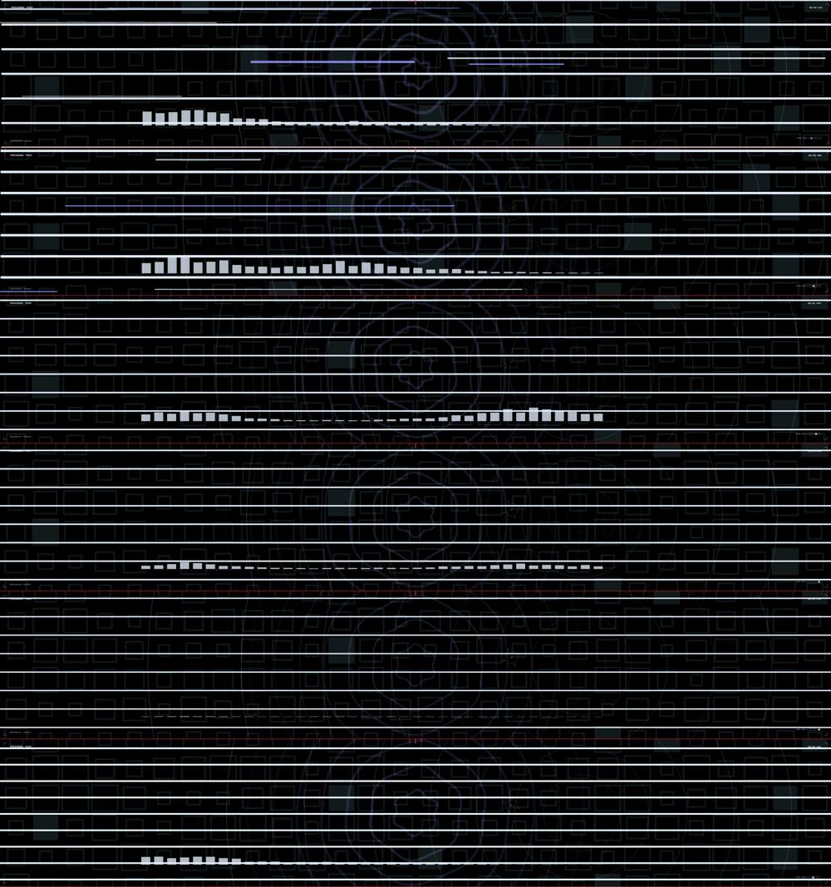

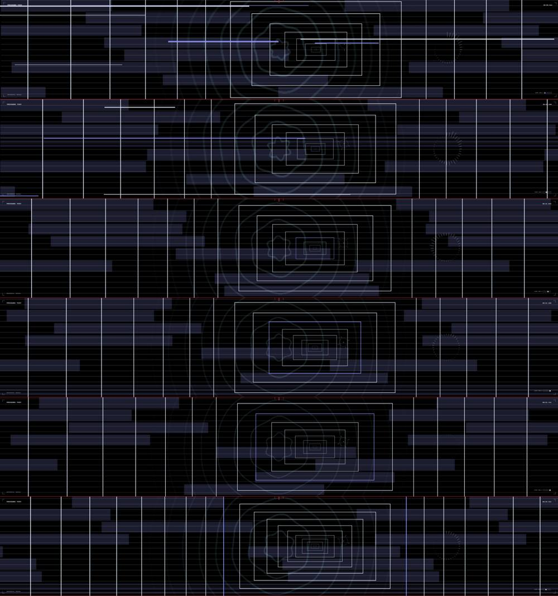

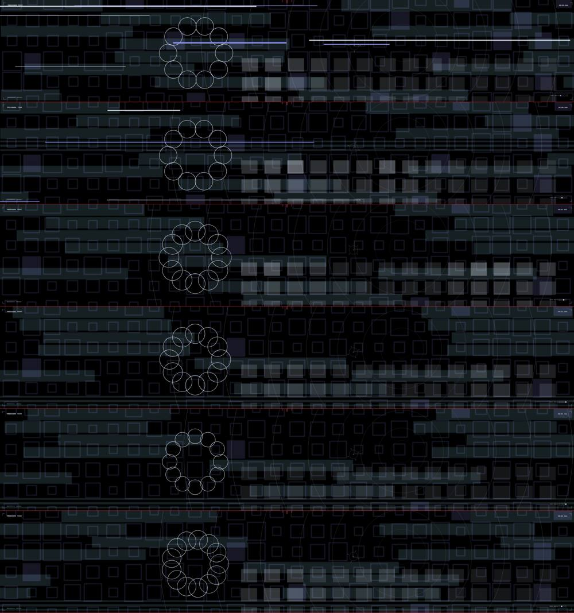

- **INDUSTRIAL I** — 89/100 · hierarchy 71 · contrast 100 · density 100 · breathing 77 · motion 100 · arc 85 · repetition 100
- **GLITCH II** — 76/100 · hierarchy 59 · contrast 44 · density 100 · breathing 67 · motion 100 · arc 85 · repetition 100
- **INDUSTRIAL III** — 87/100 · hierarchy 98 · contrast 51 · density 100 · breathing 80 · motion 100 · arc 85 · repetition 100

## Jardim de Luz (`02-jardim-tela`)

> Um organismo de luz que cresce devagar e respira com a música; o público deve sentir cuidado e espanto.

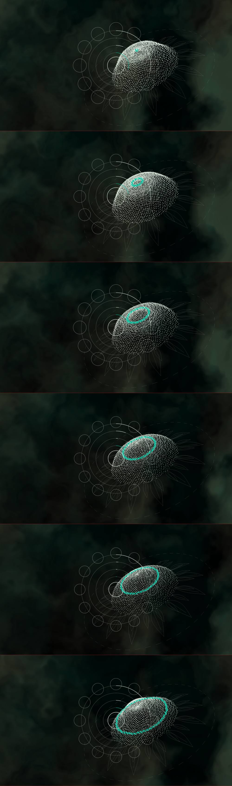

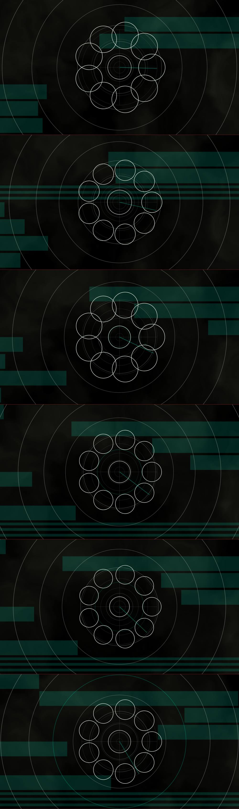

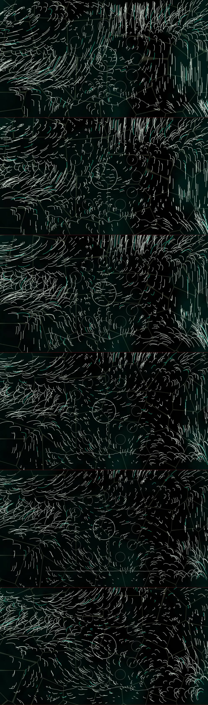

- **ORGANIC I** — 98/100 · hierarchy 100 · contrast 100 · density 100 · breathing 87 · motion 100 · arc 100 · repetition 100
- **CALM II** — 88/100 · hierarchy 66 · contrast 100 · density 100 · breathing 68 · motion 100 · arc 100 · repetition 100
- **ORGANIC III** — 85/100 · hierarchy 69 · contrast 100 · density 88 · breathing 47 · motion 100 · arc 100 · repetition 100

## Poço Cósmico (`03-vertical-cosmos`)

> Uma queda lenta por um poço de estrelas em uma tela vertical; vertigem suave, sem pressa.







- **COSMIC I** — 87/100 · hierarchy 47 · contrast 81 · density 100 · breathing 100 · motion 100 · arc 100 · repetition 100
- **COSMIC II** — 79/100 · hierarchy 53 · contrast 23 · density 100 · breathing 100 · motion 100 · arc 100 · repetition 100
- **COSMIC III** — 79/100 · hierarchy 53 · contrast 26 · density 93 · breathing 100 · motion 100 · arc 100 · repetition 100

## Sirene (`04-torre-urbana`)

> Faixas e palavras gritadas em uma torre estreita de LED, como sinal de rua à noite.





- **URBAN I** — 88/100 · hierarchy 54 · contrast 100 · density 100 · breathing 100 · motion 84 · arc 100 · repetition 100
- **AGGRESSIVE II** — 81/100 · hierarchy 73 · contrast 62 · density 100 · breathing 50 · motion 99 · arc 100 · repetition 100
- **URBAN III** — 92/100 · hierarchy 69 · contrast 86 · density 100 · breathing 100 · motion 100 · arc 100 · repetition 100

## Brasa (`05-ritual-mapping`)

> Anéis de brasa em volta de um objeto no palco, como um ritual que se acende e se apaga.

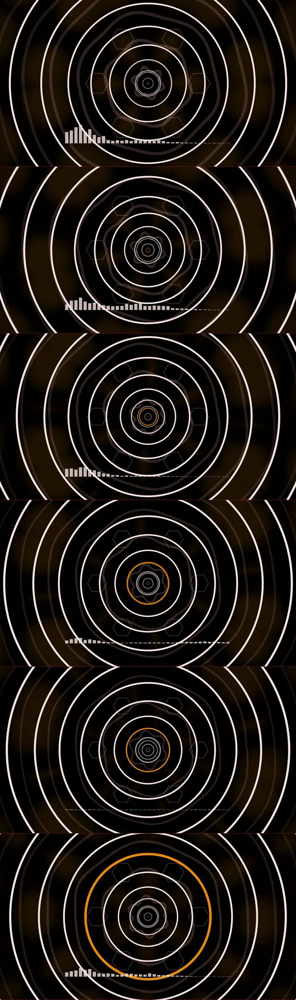

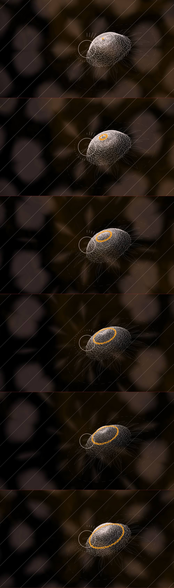

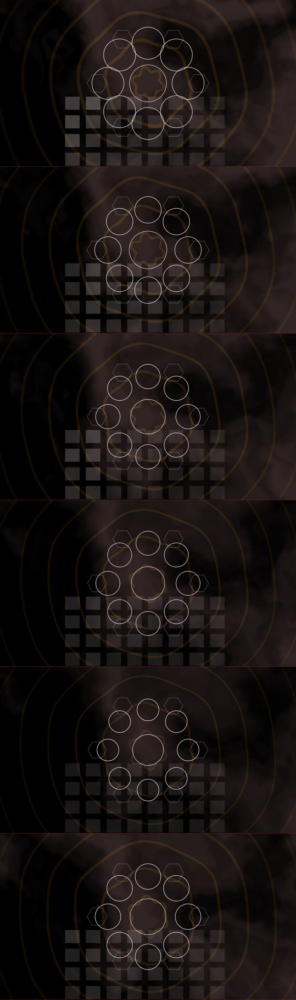

- **RITUAL I** — 90/100 · hierarchy 65 · contrast 100 · density 100 · breathing 100 · motion 93 · arc 85 · repetition 100
- **RITUAL II** — 100/100 · hierarchy 100 · contrast 100 · density 100 · breathing 100 · motion 100 · arc 100 · repetition 100
- **RITUAL III** — 91/100 · hierarchy 95 · contrast 100 · density 100 · breathing 62 · motion 100 · arc 85 · repetition 100

## Falha Geral (`06-glitch-parede`)

> Uma parede grande quebrando em blocos magenta, falhas que reorganizam a imagem no tempo da bateria.

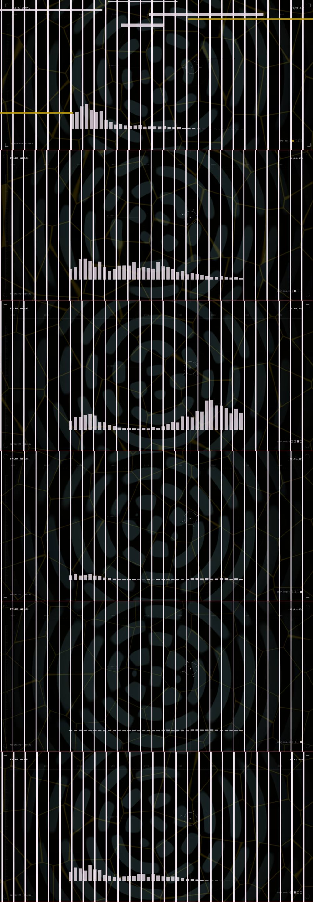

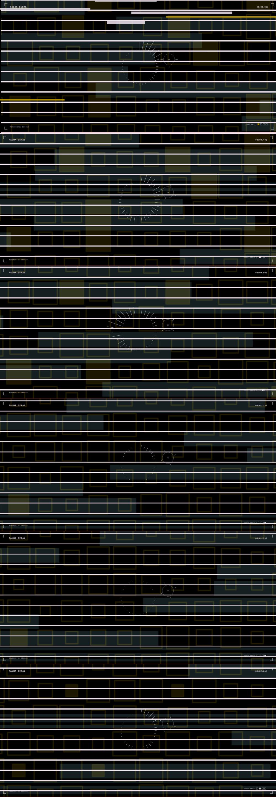

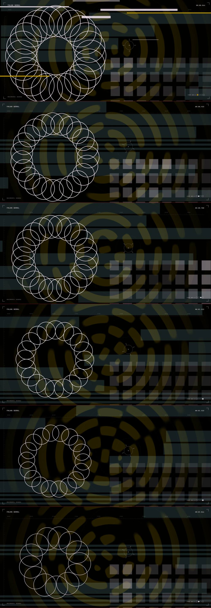

- **GLITCH I** — 97/100 · hierarchy 94 · contrast 100 · density 100 · breathing 100 · motion 100 · arc 85 · repetition 100
- **RETRO II** — 90/100 · hierarchy 63 · contrast 100 · density 100 · breathing 100 · motion 99 · arc 85 · repetition 100
- **GLITCH III** — 95/100 · hierarchy 84 · contrast 100 · density 100 · breathing 100 · motion 100 · arc 85 · repetition 100

## Correnteza (`07-liquido-tela`)

> Água azul deslizando sobre água azul; calma que não é vazia.

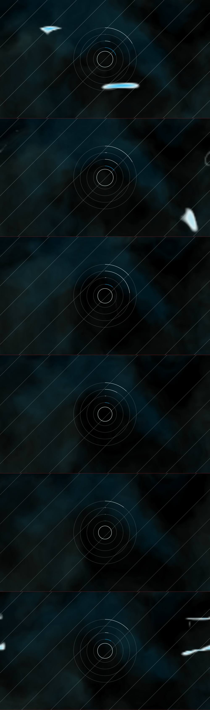

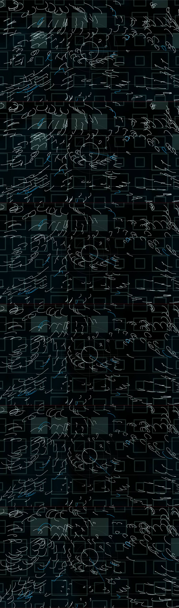

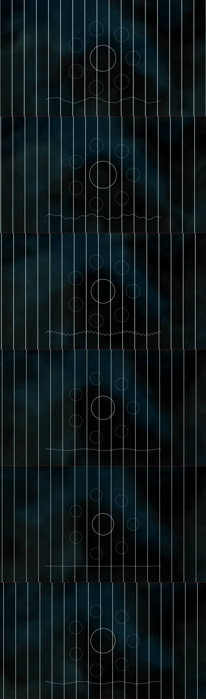

- **LIQUID I** — 87/100 · hierarchy 100 · contrast 27 · density 100 · breathing 100 · motion 100 · arc 85 · repetition 100
- **CALM II** — 83/100 · hierarchy 81 · contrast 26 · density 100 · breathing 100 · motion 100 · arc 85 · repetition 100
- **LIQUID III** — 83/100 · hierarchy 56 · contrast 62 · density 100 · breathing 100 · motion 100 · arc 85 · repetition 100

## Vão (`08-minimal-multi`)

> Um círculo e quatro linhas em três telas lado a lado; o silêncio entre as telas faz parte da peça.

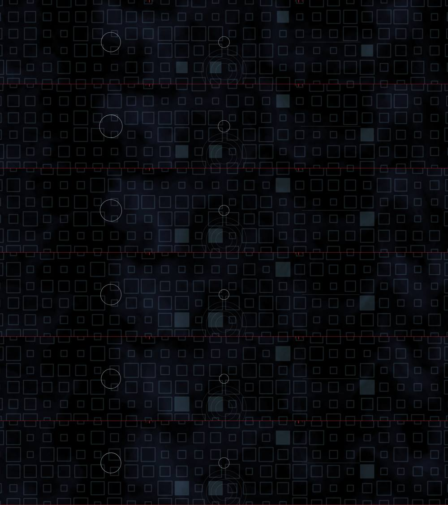

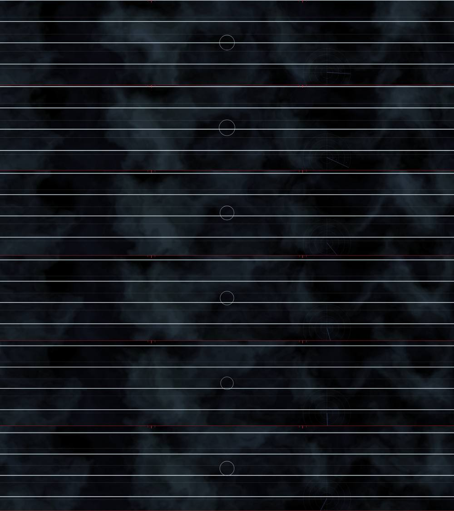

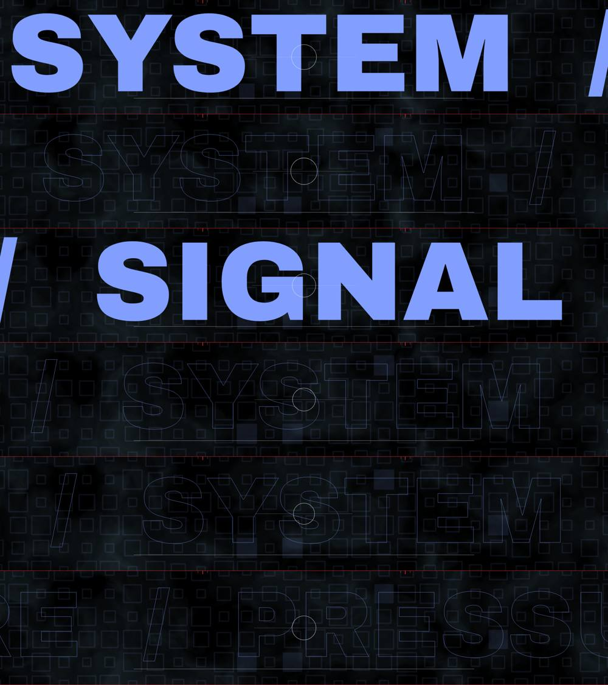

- **MINIMAL I** — 82/100 · hierarchy 96 · contrast 4 · density 100 · breathing 98 · motion 100 · arc 85 · repetition 100
- **MINIMAL II** — 84/100 · hierarchy 78 · contrast 37 · density 100 · breathing 100 · motion 100 · arc 85 · repetition 100
- **MINIMAL III** — 95/100 · hierarchy 81 · contrast 96 · density 100 · breathing 100 · motion 98 · arc 100 · repetition 100
